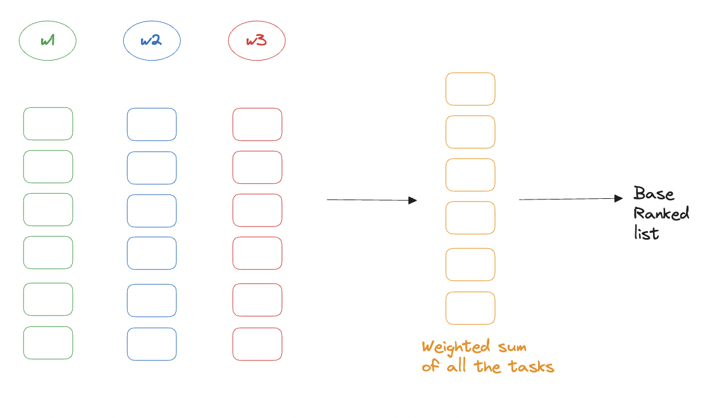
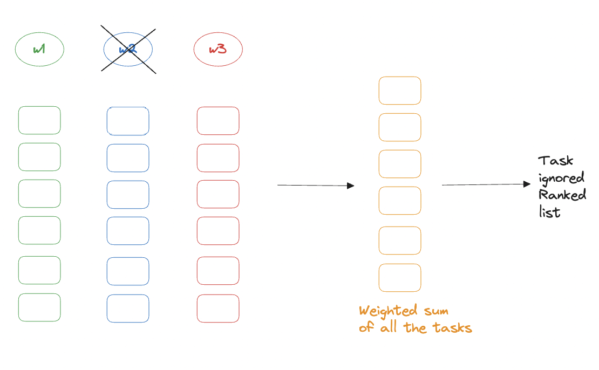
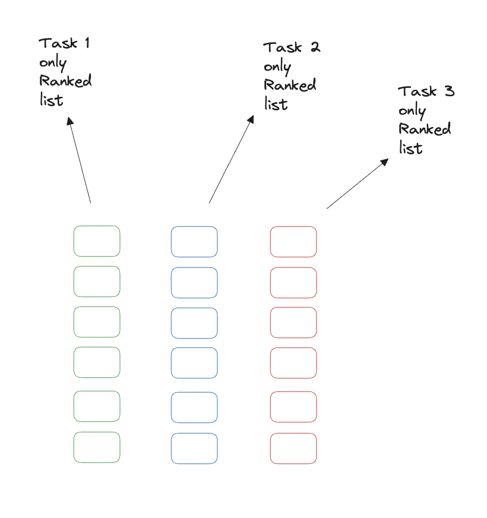

# value_model_tuning

Modern recsys use value models but practitioners often find it hard to tune them. This repo contains two algorithms I've found to work well for this. Think of them as a steering wheel for a car. You don't want to just drive, you want to drive in a certain direction. These algorithms help you steer in the direction of your choosing.

Value models (also known as multi-task fusion models) are a common component in modern recommender systems. They take estimates from the final ranking model for different tasks and combine them to create the final ranked list of recommendations. The main reason to use a value model is becasue the real business goal is not just to optimize for one point-wise task, but instead to optimize for a more complex objective, such as maximizing user engagement or revenue. The value model is a sort of surrogate or proxy for the real objective.

For more background on value models in recommender systems, see:

- [Multi-Task Fusion via Reinforcement Learning for Long-Term User Satisfaction in Recommender Systems](https://arxiv.org/abs/2208.04560)
- [Ranking model calibration in recommender systems](https://recsysml.substack.com/p/ranking-model-calibration-in-recommender)

This repository provides tools to compute optimal weights for a linear value model based on intended importance of different tasks.

## Contents

- [sample_vm.json](./src/sample_vm.json): Example value model configuration
- [ndcg_gap_targeting_heuristic.py](./src/ndcg_gap_targeting_heuristic.py): NDCG-Gap-based weight optimization using a heuristic approach
- [ndcg_gap_targeting_slsqp.py](./src/ndcg_gap_targeting_slsqp.py): NDCG-Gap-based weight optimization using SLSQP
- [regret_targeting.py](./src/regret_targeting.py): Regret-based weight optimization

## NDCG Gap Targeting

The `ndcg_gap_targeting_heuristic.py` script optimizes value model weights to target specific NDCG (Normalized Discounted Cumulative Gain) drops from base ranking on zeroing out the weights for each task. It uses gradient descent to find weights that produce NDCG scores close to the desired targets.

Key features:

- Supports multiple tasks with individual NDCG targets
- Configurable learning rate and number of iterations
- Outputs optimized weights for each task

### How NDCG Gap Targeting Works

1. **Base Ranking**: First, we compute a base ranking using all task weights:

   

2. **Task-Ignored Ranking**: For each task, we compute a new ranking by setting its weight to zero:

   

3. **NDCG gap**: We calculate the NDCG difference between the base ranking and each task-ignored ranking. This gap represents the importance of each task.

4. **Optimization**: The algorithm adjusts weights to achieve desired NDCG gap ratios/fractions for each task, effectively tuning the importance of each component in the value model.

### Supports both Black-box and Explicit Optimizations

[ndcg_gap_targeting_heuristic.py](./src/ndcg_gap_targeting_heuristic.py) uses a white-box/heuristic optimization approach whereas [ndcg_gap_targeting_slsqp.py](./src/ndcg_gap_targeting_slsqp.py) uses SLSQP to optimize the weights. I believe the latter should be more accurate, but for whatever reason it's not working as well as I'd hoped. Currently, the SLSQP approach is terminating without converging.

```text
python ndcg_gap_targeting_slsqp.py
Initial weights: ['0.200', '0.200', '0.200', '0.200', '0.200']

Final results:
  nDCG regrets for each task ignored: ['0.003', '0.002', '0.002', '0.002', '0.004']
  Current fractions: ['0.207', '0.183', '0.115', '0.180', '0.315']
  Desired fractions: ['0.300', '0.500', '0.070', '0.070', '0.060']
  Optimization success: True
  Optimization message: Optimization terminated successfully
Optimized weights: ['0.200', '0.200', '0.200', '0.200', '0.200']
```

whereas the white-box approach works as expected:

```text
python ndcg_gap_targeting_heuristic.py
Initial weights: ['0.200', '0.200', '0.200', '0.200', '0.200']

Final results:
  nDCGs for each task ignored: ['0.994', '0.990', '0.999', '0.999', '0.999']
  Current fractions: ['0.297', '0.504', '0.069', '0.072', '0.058']
  Desired fractions: ['0.300', '0.500', '0.070', '0.070', '0.060']
Optimized weights: ['0.269', '0.354', '0.137', '0.143', '0.097']
```

## Regret Targeting

The [regret_targeting.py](./src/regret_targeting.py) script takes a different approach. For each task, it looks at the ranking to optimize that task. Then it defines regret as the nDCG between the optimized weights ranking and the per-rask optimal ranking. The script has been provided a target regret ratio/fraction between tasks, and it finds the weights that produce this regret. This can be useful for balancing multiple competing objectives.

Key features:

- Minimizes regret across multiple tasks
- Configurable regularization to prevent overfitting
- Outputs optimized weights that balance task importance

### How Regret Targeting Works

1. **Per Task Rankings**: First, we compute a per-task ranking using only the weights for that task:

   

2. **Current Ranking**: Then, we compute a ranking using the current task weights:

   

3. **Regret Calculation**: For each task, we calculate the regret as 1 - the nDCG between the base ranking and the per-task optimal ranking. The nDCG represents how aligned the current ranking is with the optimal ranking for that task. Hence 1 - nDCG represents the regret.

4. **Optimization**: The algorithm adjusts weights based on the importance adjusted by the regret of that task, effectively tuning the importance of each component in the value model.

### Status

Works fine. As you can see from the output below, the relative regrest values, i.e. "Current regret fractions" are pretty close to the desired fractions.

```text
python regret_targeting.py
Initial weights: ['0.200', '0.200', '0.200', '0.200', '0.200']

Final results:
  Regrets for each task: ['0.084', '0.053', '0.054', '0.035', '0.029']
  Current regret gaps: ['0.025', '0.026', '0.004', '0.002', '0.002']

Optimized weights: ['0.546', '0.355', '0.036', '0.032', '0.030']
```

## Usage

There are examples of usage in each script's docstrings and at the bottom of each script. Commands to run each script are provided in the docstrings.

## Contributing

Contributions to improve and extend these tools are welcome! Please submit issues and pull requests.
